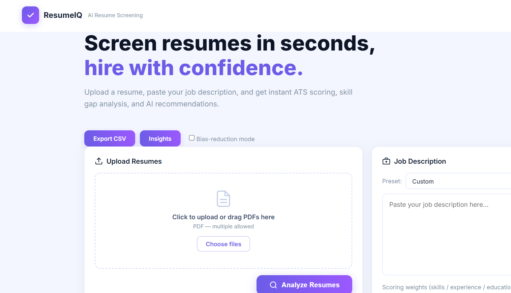
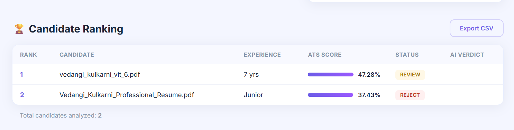
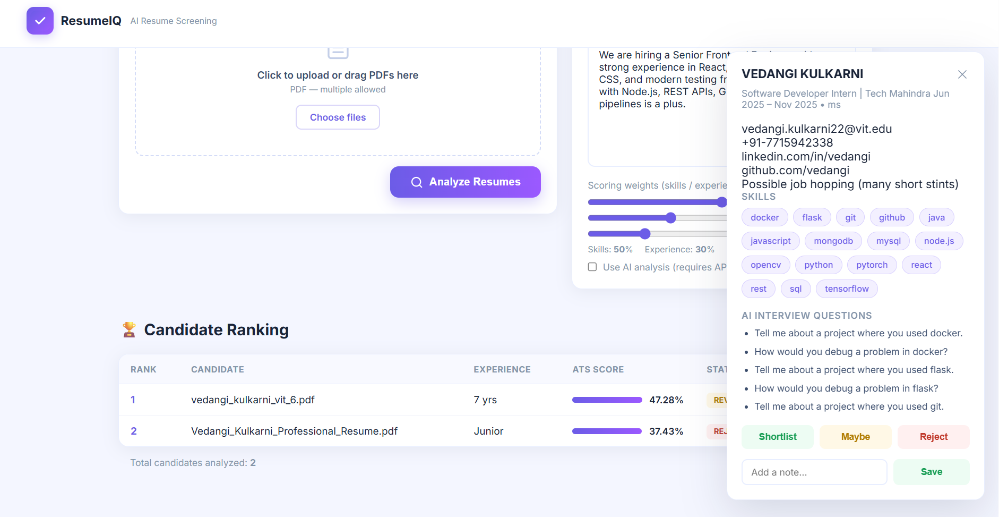
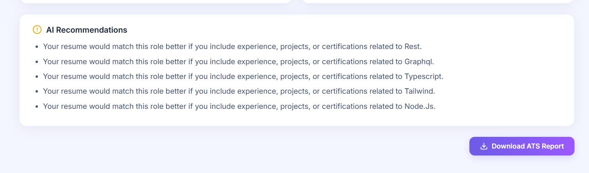

# AI Resume Screening System

AI-powered Resume Screening System built with Flask that helps recruiters and HR teams automatically evaluate resumes against job descriptions.

## Live Demo

https://resume-screening-ai-3dhl.onrender.com

## Features

✅ ATS Score Calculation

✅ Resume vs Job Description Matching

✅ Skill Gap Analysis

✅ Candidate Ranking

✅ PDF Resume Parsing

✅ AI Resume Suggestions

✅ Multiple Resume Screening

✅ Resume Summary Generation

✅ Downloadable ATS Report

---

## Tech Stack

* Python
* Flask
* HTML
* CSS
* Jinja2
* PyPDF2
* Gunicorn
* Render

---

## Project Architecture

User Uploads Resume(s)
↓
PDF Parser (PyPDF2)
↓
Text Extraction
↓
Skill Extraction Engine
↓
ATS Matching Algorithm
↓
Candidate Ranking Engine
↓
AI Suggestions Generator
↓
Dashboard & Report Generation

---

## Screenshots

### Home Page

### Candidate Ranking

### Resume Summary

### AI Suggestions

---

## How ATS Score is Calculated

ATS Score =

(Number of Matched Skills ÷ Number of Required Skills) × 100

Candidates are automatically categorized as:

* SHORTLIST (70%+)
* REVIEW (40–69%)
* REJECT (<40%)

---

## Installation

Clone repository:

git clone https://github.com/vedangi-24/resume-screening-ai.git

Install dependencies:

pip install -r requirements.txt

Run application:

python app.py

---

## Future Enhancements

* OpenAI-powered resume recommendations
* Resume improvement roadmap
* PDF report generation
* Recruiter login system
* Resume database integration
* Email notifications

---

## Author

Vedangi Kulkarni

GitHub:
https://github.com/vedangi-24

---
